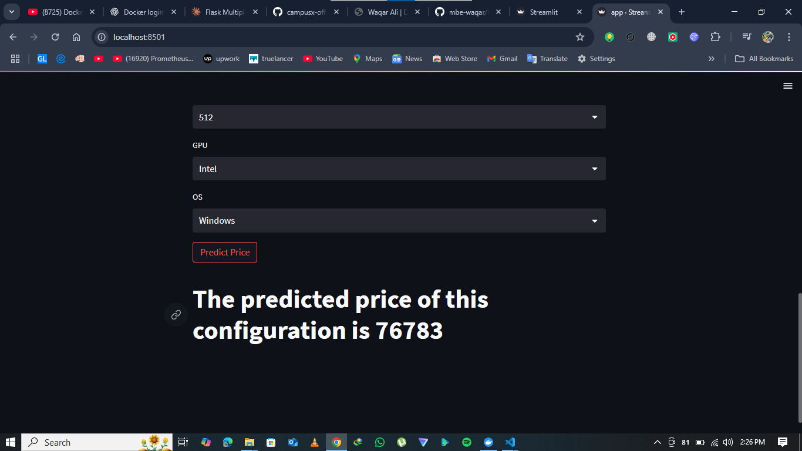

# Laptop Price Predictor - Regression Project

A machine learning web application that predicts laptop prices based on various specifications using regression models. Built with Streamlit and deployed using Docker for easy scalability and portability.

## 🚀 Features

- 🤖 **Machine Learning Model**: Regression-based price prediction
- 📊 **Data Analysis**: Comprehensive laptop dataset analysis
- 🌐 **Interactive Web App**: User-friendly Streamlit interface
- 🐳 **Dockerized**: Easy deployment and scalability
- 📈 **Model Training**: Jupyter notebook for model development
- 🔧 **Preprocessing**: Data cleaning and feature engineering
- ⚡ **Real-time Predictions**: Instant price estimates

## 📋 Table of Contents

- [Project Structure](#project-structure)
- [Prerequisites](#prerequisites)
- [Installation & Usage](#installation--usage)
- [Dataset](#dataset)
- [Model Information](#model-information)
- [Streamlit Interface](#streamlit-interface)
- [Docker Deployment](#docker-deployment)
- [Development](#development)
- [Contributing](#contributing)

## 📁 Project Structure

```
Laptop-Price-Predictor-Regression-Project/
├── app.py                      # Main Streamlit application
├── laptop_data                 # Dataset file (Excel format)
├── laptop-price-predictor      # Jupyter notebook for model development
├── pipe.pkl                    # Trained machine learning pipeline
├── df.pkl                      # Processed dataframe
├── Procfile                    # Heroku deployment configuration
├── requirements.txt            # Python dependencies
├── Dockerfile                  # Docker configuration
├── setup                       # Setup/configuration files
└── README.md                   # Project documentation
```

## 🔧 Prerequisites

Before running this application, ensure you have:

- **Docker** (recommended) - [Install Docker](https://docs.docker.com/get-docker/)
- **Python 3.9+** (for local development)
- **pip** (Python package manager)
- **Jupyter Notebook** (for model development)

## 🚀 Installation & Usage

### Option 1: Using Docker (Recommended)

1. **Clone the repository**
   ```bash
   git clone https://github.com/yourusername/Laptop-Price-Predictor-Regression-Project.git
   cd Laptop-Price-Predictor-Regression-Project
   ```

2. **Build the Docker image**
   ```bash
   docker build -t laptop-price-predictor .
   ```

3. **Run the container**
   ```bash
   docker run -p 8501:8501 laptop-price-predictor
   ```

4. **Access the application**
   Open your browser and go to: `http://localhost:8501`

### Option 2: Local Development

1. **Clone the repository**
   ```bash
   git clone https://github.com/yourusername/Laptop-Price-Predictor-Regression-Project.git
   cd Laptop-Price-Predictor-Regression-Project
   ```

2. **Create virtual environment**
   ```bash
   python -m venv venv
   source venv/bin/activate  # Windows: venv\Scripts\activate
   ```

3. **Install dependencies**
   ```bash
   pip install -r requirements.txt
   ```

4. **Run the Streamlit application**
   ```bash
   streamlit run app.py
   ```

5. **Access the application**
   Navigate to: `http://localhost:8501`

## 📊 Dataset

The project uses a comprehensive laptop dataset (`laptop_data`) containing:

- **Brand**: Laptop manufacturer
- **Processor**: CPU specifications
- **RAM**: Memory capacity
- **Storage**: Hard drive/SSD details
- **Graphics**: GPU information
- **Screen Size**: Display dimensions
- **Operating System**: OS type
- **Price**: Target variable for prediction

## 🤖 Model Information

### Machine Learning Pipeline
- **Algorithm**: Regression-based prediction model
- **Pipeline**: Saved as `pipe.pkl` for consistent preprocessing and prediction
- **Data**: Processed dataframe stored in `df.pkl`
- **Features**: Multiple laptop specifications used for price prediction

### Model Development
The Jupyter notebook (`laptop-price-predictor`) contains:
- Exploratory Data Analysis (EDA)
- Data preprocessing and cleaning
- Feature engineering
- Model training and evaluation
- Performance metrics and validation

## 📱 Streamlit Interface

The Streamlit web application provides:

- **Interactive Input Forms**: Easy-to-use dropdowns and sliders for laptop specifications
- **Real-time Predictions**: Instant price estimates as you adjust parameters
- **Visual Feedback**: Charts and graphs showing prediction confidence
- **Responsive Design**: Works on desktop and mobile devices
- **User-friendly UI**: Clean, intuitive interface for non-technical users

### Key Interface Features:
- Sidebar with input controls
- Main panel showing prediction results
- Data visualization components
- Model performance metrics display

## 🐳 Docker Deployment

### Docker Configuration
Your Dockerfile is configured as:
```dockerfile
# Base image: Python 3.9
FROM python:3.9

# Set working directory
WORKDIR /app

# Copy project files
COPY . /app

# Install dependencies
RUN pip install -r requirements.txt

# Expose Streamlit port
EXPOSE 8501

# Run Streamlit application
CMD ["python", "./app.py"]
```

### Docker Commands

```bash
# Build image
docker build -t laptop-price-predictor .

# Run container
docker run -p 8501:8501 laptop-price-predictor

# Run in background
docker run -d -p 8501:8501 laptop-price-predictor

# Stop container
docker stop <container-id>

# View logs
docker logs <container-id>
```

### Alternative Streamlit Docker Command
If your app.py doesn't handle Streamlit execution directly:
```bash
# Update Dockerfile CMD to:
CMD ["streamlit", "run", "app.py", "--server.port=8501", "--server.address=0.0.0.0"]
```

## ☁️ Cloud Deployment

### Heroku Deployment
The project includes a `Procfile` for Heroku deployment. Update your Procfile:
```
web: streamlit run app.py --server.port=$PORT --server.address=0.0.0.0
```

Deployment steps:
1. **Install Heroku CLI**
2. **Login to Heroku**
   ```bash
   heroku login
   ```

3. **Create Heroku app**
   ```bash
   heroku create your-app-name
   ```

4. **Deploy**
   ```bash
   git push heroku main
   ```

### Streamlit Cloud
You can also deploy directly to Streamlit Cloud:
1. Push your code to GitHub
2. Go to [share.streamlit.io](https://share.streamlit.io)
3. Connect your GitHub repository
4. Deploy with one click

## 🔧 Development

### Running Streamlit Locally
```bash
streamlit run app.py
```

### Running Jupyter Notebook
```bash
jupyter notebook laptop-price-predictor.ipynb
```

### Model Training
To retrain the model:
1. Open the Jupyter notebook
2. Run all cells to process data and train the model
3. The trained pipeline will be saved as `pipe.pkl`
4. Processed data will be saved as `df.pkl`

### Streamlit Configuration
Create a `.streamlit/config.toml` file for custom configuration:
```toml
[server]
port = 8501
address = "0.0.0.0"

[theme]
primaryColor = "#FF6B6B"
backgroundColor = "#FFFFFF"
secondaryBackgroundColor = "#F0F2F6"
textColor = "#262730"
```

## 📈 Performance Metrics

The model performance can be evaluated using:
- **R² Score**: Coefficient of determination
- **Mean Absolute Error (MAE)**
- **Root Mean Square Error (RMSE)**
- **Cross-validation scores**

These metrics are displayed in the Streamlit interface for transparency.

## 🛠️ Troubleshooting

### Common Issues

1. **Missing pickle files**
   ```bash
   # Run the Jupyter notebook to generate pipe.pkl and df.pkl
   jupyter notebook laptop-price-predictor.ipynb
   ```

2. **Port already in use**
   ```bash
   # Use different port
   docker run -p 8502:8501 laptop-price-predictor
   # Or locally: streamlit run app.py --server.port 8502
   ```

3. **Streamlit not starting**
   ```bash
   # Check if running in app.py
   # Should include: streamlit run or st.run()
   ```

4. **Memory issues with large dataset**
   ```bash
   # Increase Docker memory allocation
   docker run -m 2g -p 8501:8501 laptop-price-predictor
   ```

## Demo



## 🤝 Contributing

1. Fork the repository
2. Create a feature branch: `git checkout -b feature-name`
3. Make your changes
4. Test the Streamlit interface
5. Run model validation
6. Commit changes: `git commit -am 'Add feature'`
7. Push to branch: `git push origin feature-name`
8. Submit a pull request

## 📋 Requirements

Key dependencies include:
- streamlit
- scikit-learn
- pandas
- numpy
- matplotlib
- seaborn
- plotly (for interactive charts)
- jupyter

See `requirements.txt` for complete list.

## 🎯 Usage Examples

### Making Predictions
1. Open the Streamlit app
2. Select laptop specifications from the sidebar:
   - Choose brand
   - Select processor type
   - Set RAM amount
   - Choose storage type and size
   - Select graphics card
   - Set screen size
3. View real-time price prediction
4. Explore different configurations

## 📄 License

This project is licensed under the MIT License - see the [LICENSE](LICENSE) file for details.

## 🙏 Acknowledgments

- Dataset providers for laptop specifications
- Streamlit community for the amazing framework
- Open-source machine learning community
- scikit-learn documentation

## 📞 Support

If you encounter any issues:
1. Check the [Issues](https://github.com/yourusername/Laptop-Price-Predictor-Regression-Project/issues) page
2. Create a new issue with detailed description
3. Provide system information and error logs
4. Include Streamlit version and browser information

## 🚀 Future Enhancements

- [ ] Add more laptop brands and models
- [ ] Implement real-time data updates
- [ ] Add price trend analysis
- [ ] Include laptop comparison features
- [ ] Add model explainability features
- [ ] Implement A/B testing for different models

---

**⭐ If you find this project helpful, please give it a star!**

**Made with ❤️ by [Waqar Ali](https://www.linkedin.com/in/waqar-ali-b70976322/)**